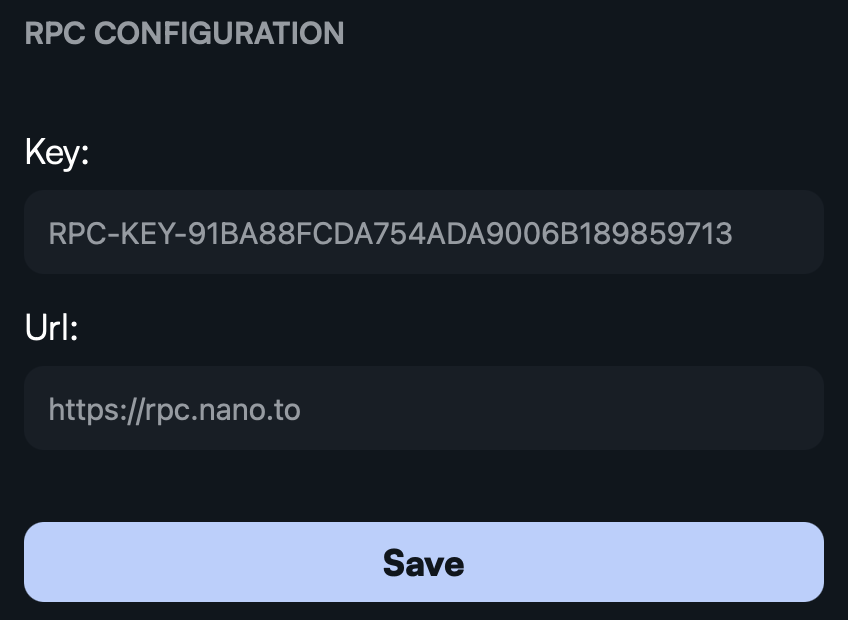

<a id="readme-top"></a>


<!-- PROJECT LOGO -->
<br />
<div align="center">
  <a href="https://github.com/diogogomesaraujo/aokiji">
    
  </a>

  <h3 align="center">Aokiji</h3>

  <p align="center">
    A Rust-pure wallet for Nano group transactions using FROST
  </p>
</div>


<!-- TABLE OF CONTENTS -->
<details>
  <summary>Table of Contents</summary>
  <ol>
    <li>
      <a href="#about-the-project">About The Project</a>
      <ul>
        <li><a href="#built-with">Built With</a></li>
      </ul>
    </li>
    <li>
      <a href="#getting-started">Getting Started</a>
      <ul>
        <li><a href="#prerequisites">Prerequisites</a></li>
        <li><a href="#installation">Installation</a></li>
      </ul>
    </li>
    <li>
      <a href="#usage">Usage</a>
      <ul>
        <li><a href="#selecting-a-node-and-getting-an-api-key">Selecting a Node and Getting an API-KEY</a></li>
        <li><a href="#creating-accounts">Creating Accounts</a></li>
        <li><a href="#opening-accounts">Opening Accounts</a></li>
        <li><a href="#transactions">Transactions</a></li>
      </ul>
    </li>
    <li><a href="#contributing">Contributing</a></li>
  </ol>
</details>


<!-- ABOUT THE PROJECT -->
## About The Project

<div align="center">
    
</div>

Aokiji is a desktop wallet that allows users to create shared accounts and execute group transactions in Nano's blockchain. It was developed as the Final Project of my Computer Science degree in Universidade da Beira Interior with the help of Professor Doctor Paul Andrew Crocker. Check out the [report](./report.pdf) and a [demonstration](https://www.youtube.com/watch?v=OCCDltagltI&ab_channel=DiogoAraujo/).

**Why should you use Aokiji?:**
* It is a **client-side only** application where a group can sign transactions **without accessing a centralized server**. Additionally, users are able to **select the Node** where the transactions will be processed.
* It is built with modern technologies and protocols like **Rust**, **Dalek** and **FROST**, making it fast and secure.
* Finally, it is **simple**, **lightweight** and **easy-to-use** unlike other options on the market.

If you want to dive deeper into the development check out [frost-sig](https://github.com/diogogomesaraujo/frost-sig), where the lower-level operations like key generation, signing and veryfying are implemented.

<p align="right">(<a href="#readme-top">back to top</a>)</p>


### Built With

These are some of the tools used to build this application. They provided a strong foundation to assure its integrity and robustness.

* `Rust`: the programming language used for this project.
* `Dioxus`: for building the desktop application.
* `Dalek`: for implementing FROST and validating.
* `Tokio`: to communicate within the group.

<p align="right">(<a href="#readme-top">back to top</a>)</p>


<!-- GETTING STARTED -->
## Getting Started

You can install Aokiji by downloading the latest [release](https://github.com/diogogomesaraujo/aokiji/releases/latest) available for your operating system or, alternatively, build it from source by following these steps.

### Prerequisites

In order to run build this application from source you will need to have `cargo`,  `cargo-binstall` and `dioxus-cli` installed. To install them you can follow this [tutorial](https://dioxuslabs.com/learn/0.6/getting_started/#) by Dioxus.

### Installation

1. Clone the repo

   ```sh
   git clone https://github.com/diogogomesaraujo/aokiji.git
   ```

3. Go to the project's directory

5. Inside the project go to the following directory

   ```sh
   cd frontend/aokiji
   ```

6. Compile the application to an executable or simply run it

   ```sh
   # Run the application
   dx serve
   
   # Bundle the application
   dx bundle
   ```

8. Access the executable's folder and install the application

   ```sh
   cd dist
   ```

<p align="right">(<a href="#readme-top">back to top</a>)</p>


<!-- USAGE EXAMPLES -->
## Usage

### Selecting a Node and Getting an API-KEY

To be able to fully utilize Aokiji you will need to choose a [node](https://publicnodes.somenano.com/) and get a valid API-KEY. After doing so, inside the account's dashboard, select the **Transaction** section, scroll down to the configuration and update it.

<div align="center">
    
</div>

<p align="right">(<a href="#readme-top">back to top</a>)</p>

### Creating Accounts

To create an account, the group must select a main participant that should open the connection (by selecting the **OPEN** type) while others must connect to the main participant's IP (by selecting the **JOIN** type). Participants must agree to a number of participants and threshold or else the protocol will abort.

Additionally, in the **Save To File** section it is important to write an absolute path or the protocol might fail.

<div align="center">
    
</div>

<p align="right">(<a href="#readme-top">back to top</a>)</p>

### Opening Accounts

To process transactions collectively, the group must also select a main participant that should open the connection while others connect to their IP address. Participants must also agree to the amount (when sending Nano) or the operation will abort.


<div align="center">
    
</div>

<p align="right">(<a href="#readme-top">back to top</a>)</p>

### Transactions

To process transactions collectively, the group must also select a main participant that should open the connection while others connect to their IP address. Participants must also agree to the amount (when sending Nano) or the operation will abort.


<div align="center">
    
</div>

<p align="right">(<a href="#readme-top">back to top</a>)</p>

<!-- CONTRIBUTING -->
## Contributing

This application is fully **open-source** so feel free to contribute to it or fork and adapt it to your liking.

<p align="right">(<a href="#readme-top">back to top</a>)</p>


<!-- MARKDOWN LINKS & IMAGES -->
<!-- https://www.markdownguide.org/basic-syntax/#reference-style-links -->
[contributors-shield]: https://img.shields.io/github/contributors/othneildrew/Best-README-Template.svg?style=for-the-badge
[contributors-url]: https://github.com/othneildrew/Best-README-Template/graphs/contributors
[forks-shield]: https://img.shields.io/github/forks/othneildrew/Best-README-Template.svg?style=for-the-badge
[forks-url]: https://github.com/othneildrew/Best-README-Template/network/members
[stars-shield]: https://img.shields.io/github/stars/othneildrew/Best-README-Template.svg?style=for-the-badge
[stars-url]: https://github.com/othneildrew/Best-README-Template/stargazers
[issues-shield]: https://img.shields.io/github/issues/othneildrew/Best-README-Template.svg?style=for-the-badge
[issues-url]: https://github.com/othneildrew/Best-README-Template/issues
[license-shield]: https://img.shields.io/github/license/othneildrew/Best-README-Template.svg?style=for-the-badge
[license-url]: https://github.com/othneildrew/Best-README-Template/blob/master/LICENSE.txt
[linkedin-shield]: https://img.shields.io/badge/-LinkedIn-black.svg?style=for-the-badge&logo=linkedin&colorB=555
[linkedin-url]: https://linkedin.com/in/othneildrew
[product-screenshot]: images/screenshot.png
[Next.js]: https://img.shields.io/badge/next.js-000000?style=for-the-badge&logo=nextdotjs&logoColor=white
[Next-url]: https://nextjs.org/
[React.js]: https://img.shields.io/badge/React-20232A?style=for-the-badge&logo=react&logoColor=61DAFB
[React-url]: https://reactjs.org/
[Vue.js]: https://img.shields.io/badge/Vue.js-35495E?style=for-the-badge&logo=vuedotjs&logoColor=4FC08D
[Vue-url]: https://vuejs.org/
[Angular.io]: https://img.shields.io/badge/Angular-DD0031?style=for-the-badge&logo=angular&logoColor=white
[Angular-url]: https://angular.io/
[Svelte.dev]: https://img.shields.io/badge/Svelte-4A4A55?style=for-the-badge&logo=svelte&logoColor=FF3E00
[Svelte-url]: https://svelte.dev/
[Laravel.com]: https://img.shields.io/badge/Laravel-FF2D20?style=for-the-badge&logo=laravel&logoColor=white
[Laravel-url]: https://laravel.com
[Bootstrap.com]: https://img.shields.io/badge/Bootstrap-563D7C?style=for-the-badge&logo=bootstrap&logoColor=white
[Bootstrap-url]: https://getbootstrap.com
[JQuery.com]: https://img.shields.io/badge/jQuery-0769AD?style=for-the-badge&logo=jquery&logoColor=white
[JQuery-url]: https://jquery.com
